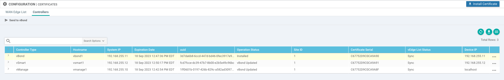
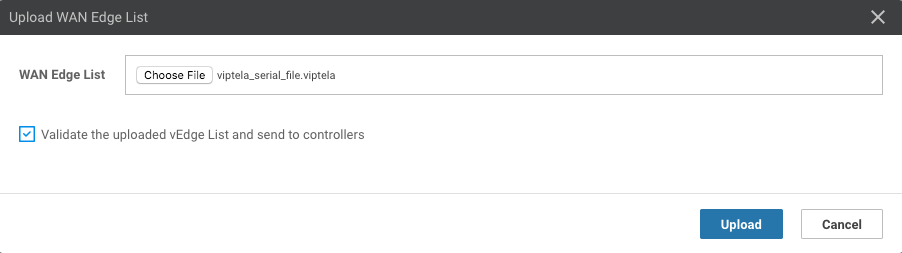
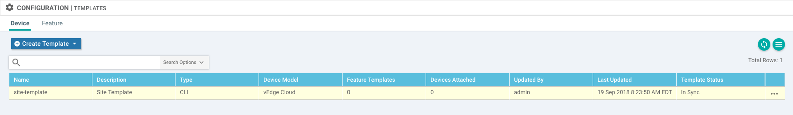
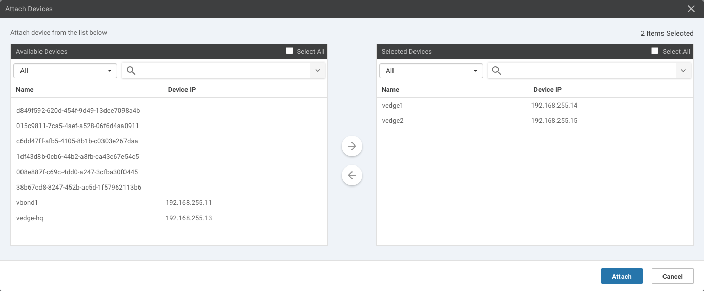
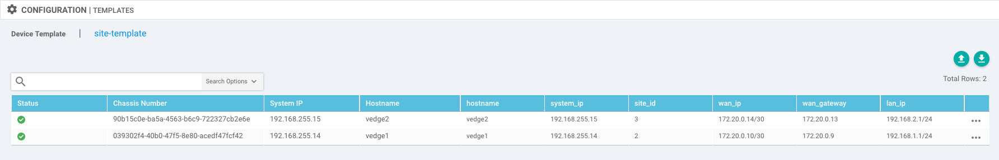

# Viptela SDx Workshop

## Requirements

* [virlutils](https://github.com/CiscoDevNet/virlutils)
* A Viptela license file and the Organization name associated with that license file.  The Organization name should be provided where you see: `<your org name>`


## Cloning this repo:

`git clone https://github.com/ciscops/viptela-workshop.git --recursive`

For more help with git, see DevNet's [A Brief Introduction to Git](https://learninglabs.cisco.com/lab/git-basic-workflows/step/1)

## Purpose
The purpose of this workshop is to augment the current dCloud offerings with a "from scratch" experience of the following:
* Setting up the Viptela control plane from scratch
* Using Enterprise certificates
* Bringing up the Viptela Overlay Network from scratch
* Integrating the Viptela Overlay Network with traditional infrastructure
* Setting up some common routing options
* Deploying template for automation

## Table of Contents
* [Topology](#topology)
* [Scenario](#scenario)
* [Deploy Topology](#deploy-topology)
* [Enterprise CA Setup](#enterprise-ca-setup)
* [Viptela Overlay Network Bringup](#viptela-overlay-network-bringup)
  * [Deploy the vManage NMS](#deploy-the-vmanage-nms)
  * [Deploy the vBond Orchestrator](#deploy-the-vbond-orchestrator)
  * [Configure the vSmart Controller](#configure-the-vsmart-controller)
  * [Configure Certificate Settings](#confnigure-certificate-settings)
  * [Deploy the vEdge Routers](#deploy-the-vedge-routers)
* [Validate](#validate)
* [Routing Options](#routing-options)
  * [Configuring OSPF between the Overlay and the HQ Network](#configuring-ospf-between-the-overlay-and-the-hq-network)
  * [Configuring NAT at the Enterprise Border](#configuring-nat-at-the-enterprise-border)
  * [Configuring NAT at the Site Border w/Templates](#configuring-nat-at-the-site-border)


## Topology


## Scenario
Enterprise has a single HQ and two remote sites.  All routing at the remote sites is handled by the vEdge.  The HQ does full internet peering, so the vEdge there is in a DMZ and exchanges routes with the HQ Core router via OSPF.

The Viptela control plane (i.e. vmanage1, vbond1, vsmart1) is hosted in the DMZ at the enterprise HQ.

### Network Setup
Since this is being done in VIRL, the first interface all of devices have a connection to the `flat` management network.  The subsequent interfaces are put into the simulated network.  For Viptela, the management interfaces are moved to VPN 512 to simulate OOB management access.  The following networks are allocated to the topology:

* 192.168.0.0/16: Enterprise private
  * 192.168.1.0/24: Enterprise Site 1
  * 192.168.2.0/24: Enterprise Site 2
  * 192.168.255.0/24: Enterprise Loopbacks/TLOCS
* 10.0.0.0/8: Enterprise routable
  * 10.0.0.0/24: Enterprise HQ DMZ
  * 10.0.1.0/24: Enterprise HQ DC
  * 10.0.255.0/24: Enterprise HQ P-T-P links
* 172.20.0.0/16: Internet Core

### Test Nodes
There are several nodes in the topology that can be used for testing:
* server1: A server sitting in the HQ data center that can be reached both internally from within the enterprise and externally.
* service1: A server sitting in an SP data center that represents a service that is not associated with the Enterprise.
* host1/2: These hosts are sitting internal to the enterprise.

_The default username/password is `admin/admin`_

## Deploy Topology

_NOTE: The Topology requires images for vmanage, vbond, vsmart, vedge, and CSR1000v_

### To deploy with virlutils

Install [virlutils](https://github.com/CiscoDevNet/virlutils)

Create a .virlrc:
```
VIRL_USERNAME=guest
VIRL_PASSWORD=guest
VIRL_HOST=your.virl.server
```

### Start the Topology
```
virl up -f viptela1.virl --provision
```

Verify the nodes are built (Note: These are the MGMT IP addresses to be used later, Note: Your addresses will be different!):

```
# virl nodes
Here is a list of all the running nodes
╒═══════════╤══════════╤═════════╤═════════════╤════════════╤══════════════════════╤════════════════════╕
│ Node      │ Type     │ State   │ Reachable   │ Protocol   │ Management Address   │ External Address   │
╞═══════════╪══════════╪═════════╪═════════════╪════════════╪══════════════════════╪════════════════════╡
│ ~mgmt-lxc │ mgmt-lxc │ ACTIVE  │ REACHABLE   │ ssh        │ 199.66.188.161       │ 199.66.188.162     │
├───────────┼──────────┼─────────┼─────────────┼────────────┼──────────────────────┼────────────────────┤
│ vedge1    │ vEdge    │ ACTIVE  │ REACHABLE   │ ssh        │ 199.66.188.169       │ N/A                │
├───────────┼──────────┼─────────┼─────────────┼────────────┼──────────────────────┼────────────────────┤
│ vedge2    │ vEdge    │ ACTIVE  │ REACHABLE   │ ssh        │ 199.66.188.170       │ N/A                │
├───────────┼──────────┼─────────┼─────────────┼────────────┼──────────────────────┼────────────────────┤
│ vbond1    │ vBond    │ ACTIVE  │ REACHABLE   │ ssh        │ 199.66.188.167       │ N/A                │
├───────────┼──────────┼─────────┼─────────────┼────────────┼──────────────────────┼────────────────────┤
│ host2     │ lxc      │ ACTIVE  │ REACHABLE   │ ssh        │ 199.66.188.174       │ N/A                │
├───────────┼──────────┼─────────┼─────────────┼────────────┼──────────────────────┼────────────────────┤
│ host1     │ lxc      │ ACTIVE  │ REACHABLE   │ ssh        │ 199.66.188.173       │ N/A                │
├───────────┼──────────┼─────────┼─────────────┼────────────┼──────────────────────┼────────────────────┤
│ vmanage1  │ vManage  │ ACTIVE  │ REACHABLE   │ ssh        │ 199.66.188.171       │ N/A                │
├───────────┼──────────┼─────────┼─────────────┼────────────┼──────────────────────┼────────────────────┤
│ sp1       │ CSR1000v │ ACTIVE  │ REACHABLE   │ telnet     │ 199.66.188.166       │ N/A                │
├───────────┼──────────┼─────────┼─────────────┼────────────┼──────────────────────┼────────────────────┤
│ service1  │ lxc      │ ACTIVE  │ REACHABLE   │ ssh        │ 199.66.188.176       │ N/A                │
├───────────┼──────────┼─────────┼─────────────┼────────────┼──────────────────────┼────────────────────┤
│ hq        │ CSR1000v │ ACTIVE  │ REACHABLE   │ telnet     │ 199.66.188.164       │ N/A                │
├───────────┼──────────┼─────────┼─────────────┼────────────┼──────────────────────┼────────────────────┤
│ server1   │ lxc      │ ACTIVE  │ REACHABLE   │ ssh        │ 199.66.188.175       │ N/A                │
├───────────┼──────────┼─────────┼─────────────┼────────────┼──────────────────────┼────────────────────┤
│ vsmart1   │ vSmart   │ ACTIVE  │ REACHABLE   │ ssh        │ 199.66.188.172       │ N/A                │
├───────────┼──────────┼─────────┼─────────────┼────────────┼──────────────────────┼────────────────────┤
│ core      │ CSR1000v │ ACTIVE  │ REACHABLE   │ telnet     │ 199.66.188.163       │ N/A                │
├───────────┼──────────┼─────────┼─────────────┼────────────┼──────────────────────┼────────────────────┤
│ vedge-hq  │ vEdge    │ ACTIVE  │ REACHABLE   │ ssh        │ 199.66.188.168       │ N/A                │
├───────────┼──────────┼─────────┼─────────────┼────────────┼──────────────────────┼────────────────────┤
│ internet  │ CSR1000v │ ACTIVE  │ REACHABLE   │ telnet     │ 199.66.188.165       │ N/A                │
╘═══════════╧══════════╧═════════╧═════════════╧════════════╧══════════════════════╧════════════════════╛
```

## Enterprise CA Setup

Since this lab was designed for dis-connected environments, we need to create our own CA.  This can be done easily on any system with openssl installed (e.g. Linux/MAC):

First, we cd into the `myCA` directory to generate our private key (Note: You'll need to use the passphrase later to sign the other CSRs):
```
$ cd myCA
$ openssl genrsa -des3 -out myCA.key 2048
Generating RSA private key, 2048 bit long modulus
..................+++
.....................+++
e is 65537 (0x10001)
Enter pass phrase for myCA.key:
Verifying - Enter pass phrase for myCA.key:
```
Then we generate a root certificate:
```
$ openssl req -x509 -new -nodes -key myCA.key -sha256 -days 1825 -out myCA.pem
Enter pass phrase for myCA.key:
You are about to be asked to enter information that will be incorporated
into your certificate request.
What you are about to enter is what is called a Distinguished Name or a DN.
There are quite a few fields but you can leave some blank
For some fields there will be a default value,
If you enter '.', the field will be left blank.
-----
Country Name (2 letter code) []:US
State or Province Name (full name) []:NC
Locality Name (eg, city) []:Raleigh
Organization Name (eg, company) []:CIDR
Organizational Unit Name (eg, section) []:SDx
Common Name (eg, fully qualified host name) []:
Email Address []: stevenca@cisco.com
```

`myCA.pem` is the CA root that you load into vManage and the vEdges when you are doing manual certificates.

Verify config file myCA.ext to be used in signing the CSRs later (already in the repo):
```
authorityKeyIdentifier=keyid,issuer
basicConstraints=CA:FALSE
keyUsage = digitalSignature, nonRepudiation, keyEncipherment, dataEncipherment
```

## [Viptela Overlay Network Bringup](https://sdwan-docs.cisco.com/Product_Documentation/Getting_Started/Viptela_Overlay_Network_Bringup)

### Deploy the vManage NMS

#### [Configure the vManage NMS](https://sdwan-docs.cisco.com/Product_Documentation/Getting_Started/Viptela_Overlay_Network_Bringup/03Deploy_the_vManage_NMS/03Configure_the_vManage_NMS)

To do this through the CLI, ssh to the vManage and configure the following:

```
vmanage# config terminal
system
 host-name             vmanage1
 system-ip             192.168.255.10
 site-id               1
 sp-organization-name  "<your org name>"
 organization-name     "<your org name>"
 vbond 10.0.0.11
!
vpn 0
 interface eth1
  ip address 10.0.0.10/24
  tunnel-interface
   allow-service all
  !
  no shutdown
 !
 ip route 0.0.0.0/0 10.0.0.1
 !
vmanage(config-interface-eth0)# commit and-quit
```

### Deploy the vBond Orchestrator

#### [Configure the vBond Orchestrator](https://sdwan-docs.cisco.com/Product_Documentation/Getting_Started/Viptela_Overlay_Network_Bringup/04Deploy_the_vBond_Orchestrator/03Configure_the_vBond_Orchestrator)

_Note: The vBond uses the vEdge image.  Once configured, it will take on the vBond personality_

To do this through the CLI, ssh to the vBond and configure the following:

```
vedge# config terminal
system
 host-name               vbond1
 system-ip               192.168.255.11
 site-id                 1
 organization-name       "<your org name>"
 vbond 10.0.0.11 local
!
vpn 0
 interface ge0/0
  ip address 10.0.0.11/24
  ipv6 dhcp-client
  tunnel-interface
   encapsulation ipsec
   allow-service all
  !
  no shutdown
 !
 ip route 0.0.0.0/0 10.0.0.1
!
vpn 512
 interface eth0
  ip dhcp-client
  no shutdown
 !
!
vedge(config-interface-eth0)# commit and-quit
Commit complete.
vbond1#
```

#### [Add the vBond Orchestrator to the Overlay Network](https://sdwan-docs.cisco.com/Product_Documentation/Getting_Started/Viptela_Overlay_Network_Bringup/04Deploy_the_vBond_Orchestrator/04Add_Additional_vBond_Orchestrators) (_Note: Use the `vpn 0` address for the vBond server - 10.0.0.11_)

Goto `https://<vManage VIRL MGMT IP Address>/` in your browser:

```
Configuration->Devices->Controllers->Add Controller->vBond->vBond Management IP Address = 10.0.0.11
Configuration->Devices->Controllers->Add Controller->vBond->Username = admin
Configuration->Devices->Controllers->Add Controller->vBond->Password = admin
Configuration->Devices->Controllers->Add Controller->vBond->Generate CSR = unchecked
```

#### Optional: [Start the Enterprise ZTP Server](https://sdwan-docs.cisco.com/Product_Documentation/Getting_Started/Viptela_Overlay_Network_Bringup/04Deploy_the_vBond_Orchestrator/05Start_the_Enterprise_ZTP_Server)

### Deploy vSmart Controller

#### [Configure the vSmart Controller](https://sdwan-docs.cisco.com/Product_Documentation/Getting_Started/Viptela_Overlay_Network_Bringup/06Deploy_the_vSmart_Controller/03Configure_the_vSmart_Controller)

To do this through the CLI, ssh to the vSmart and configure the following:

```
vsmart# config terminal
system
 host-name             vsmart1
 system-ip             192.168.255.12
 site-id               1
 domain-id             1
 organization-name     "<your org name>"
 vbond 10.0.0.11
!
vpn 0
 interface eth1
  ip address 10.0.0.12/24
  tunnel-interface
   allow-service all
  !
  no shutdown
 !
 ip route 0.0.0.0/0 10.0.0.1
!
vsmart(config-interface-eth0)# commit and-quit
```

#### [Add the vSmart Controller to the Overlay Network](https://sdwan-docs.cisco.com/Product_Documentation/Getting_Started/Viptela_Overlay_Network_Bringup/06Deploy_the_vSmart_Controller/04Add_the_vSmart_Controller_to_the_Overlay_Network) (_Note: Use the `vpn 0` address for the vSmart server - 10.0.0.12_)

```
Configuration->Devices->Controllers->Add Controller->vSmart->vSmart Management IP Address = 10.0.0.12
Configuration->Devices->Controllers->Add Controller->vSmart->Username = admin
Configuration->Devices->Controllers->Add Controller->vSmart->Password = admin
Configuration->Devices->Controllers->Add Controller->vSmart->Generate CSR = unchecked
```

### [Configure Certificate Settings](https://sdwan-docs.cisco.com/Product_Documentation/Getting_Started/Viptela_Overlay_Network_Bringup/03Deploy_the_vManage_NMS/04Configure_Certificate_Settings)

***_Note: Do not copy double quotes for the Organization Name_***

***_Note: Beware of cut-and-pasting the certs/CSRs as it can cause anomalies.  Using file upload/download is recommended_***

***_Note: Mozilla has an issue with recognizing certificate types_***

```
Administration->Settings->Organization Name = "<your org name>"
Administration->Settings->vBond = 10.0.0.11
Administration->Settings->Controller Certificate Authorization->Certificate = Signing by->Enterprise Root Certificate
Administration->Settings->Controller Certificate Authorization->Certificate = <contents of myCA/myCA.pem from above>
```

#### [Generate vManage NMS Certificate](https://sdwan-docs.cisco.com/Product_Documentation/Getting_Started/Viptela_Overlay_Network_Bringup/03Deploy_the_vManage_NMS/05Generate_vManage_NMS_Certificate)

##### [Manually Generate a Certificate](https://sdwan-docs.cisco.com/Product_Documentation/vManage_How-Tos/Configuration/Generate_a_Certificate#Manually_Generate_a_Certificate)

##### vManage

```
Configuration->Certificates->Controllers->vManage->...->Generate CSR->Download
```
Download to the myCA directory.  On your computer, `cd myCA` and:
```
$ openssl x509 -req -in vmanage1.csr -CA myCA.pem -CAkey myCA.key -CAcreateserial -out vmanage1.pem -days 1825 -sha256 -extfile myCA.ext
Signature ok
subject=/C=US/ST=California/L=San Jose/OU=<your org name>/O=vIPtela Inc/CN=vmanage-9871e6cf-bdb4-48b7-8545-3833846ae4e5-0.viptela.com/emailAddress=support@viptela.com
Getting CA Private Key
Enter pass phrase for myCA.key:
```
Install Certificate:
```
Configuration->Certificates->Controllers->Install Certificate
```

##### vBond
```
Configuration->Certificates->Controllers->vBond->...->Generate CSR->Download
```
Download to the myCA directory.  On your computer, `cd myCA` and:
```
$ openssl x509 -req -in vbond1.csr -CA myCA.pem -CAkey myCA.key -CAcreateserial -out vbond1.pem -days 1825 -sha256 -extfile myCA.ext
Signature ok
subject=/C=US/ST=California/L=San Jose/OU=<your org name>/O=vIPtela Inc/CN=vbond-478cbd4d-ee1d-4d42-8afb-76c1f7192d85-0.viptela.com/emailAddress=support@viptela.com
Getting CA Private Key
Enter pass phrase for myCA.key:
```
Install Certificate:
```
Configuration->Certificates->Controllers->Install Certificate
```
##### vSmart
```
Configuration->Certificates->Controllers->vSmart->...->Generate CSR->Download
```
Download to the myCA directory.  On your computer, `cd myCA` and:
```
$ openssl x509 -req -in vsmart1.csr -CA myCA.pem -CAkey myCA.key -CAcreateserial -out vsmart1.pem -days 1825 -sha256 -extfile myCA.ext
Signature ok
subject=/C=US/ST=California/L=San Jose/OU=<your org name>/O=vIPtela Inc/CN=vsmart-ef2a0dc1-8233-47be-b073-aa3020e52245-0.viptela.com/emailAddress=support@viptela.com
Getting CA Private Key
Enter pass phrase for myCA.key:
```
Install Certificate:
```
Configuration->Certificates->Controllers->Install Certificate
```

The information for your controllers should populate under Configuration->Certificates->Controllers:



At this point we should be able to verify control plane connectivity:
```
vmanage1# show control connections
                                   PEER                                                                        PEER                                          PEER
      PEER    PEER PEER            CONFIGURED        SITE       DOMAIN PEER                                    PRIV  PEER                                    PUB
INDEX TYPE    PROT SYSTEM IP       SYSTEM IP       ID         ID     PRIVATE IP                              PORT  PUBLIC IP                               PORT  ORGANIZATION            REMOTE COLOR     STATE UPTIME
--------------------------------------------------------------------------------------------------------------------------------------------------------------------------------------------------------------------------
0     vsmart  dtls 192.168.255.12  192.168.255.12  1          1      10.0.0.12                               12346 10.0.0.12                               12346 <your org name>       default         up     0:00:00:57
0     vbond   dtls 192.168.255.11  192.168.255.11  0          0      10.0.0.11                               12346 10.0.0.11                               12346 <your org name>       default         up     0:00:01:14
```

<!-- *** Note: *** Issue #2, vmanage kernel panics and reboots after the certificate is installed.  It takes a few minutes to come back up, but works properly afterwards. -->

#### Optional: [Create a vManage Cluster](https://sdwan-docs.cisco.com/Product_Documentation/Getting_Started/Viptela_Overlay_Network_Bringup/03Deploy_the_vManage_NMS/06Create_a_vManage_Cluster)

#### Optional: [Create a Multitenant vManage NMS](https://sdwan-docs.cisco.com/Product_Documentation/Getting_Started/Viptela_Overlay_Network_Bringup/03Deploy_the_vManage_NMS/07Create_a_Multitenant_vManage_NMS)

### Deploy the vEdge Routers

#### [Upload WAN Edge Router Authorized Serial Number File](https://sdwan-docs.cisco.com/Product_Documentation/vManage_How-Tos/Configuration/Upload_WAN_Edge_Router_Authorized_Serial_Number_File)

***_Note: You can retrieve the serial number file from your Viptela support account or as otherwise specified in the particular workshop session_***

Upload `My Serial Number Files` from [Viptela Support](https://viptela.force.com/Customers/Downloads)
```
Configuration->Devices->WAN Edge List->Upload WAN Edge List->WAN Edge List
Configuration->Devices->WAN Edge List->Upload WAN Edge List->Validate the uploaded Edge List and send to controller
```



***_Note: Make sure to check `Validate the uploaded Edge List and send to controller` or your vedges will not connect_***

#### [Configure the vEdge Routers](https://sdwan-docs.cisco.com/Product_Documentation/Getting_Started/Viptela_Overlay_Network_Bringup/07Deploy_the_vEdge_Routers/07Configure_the_vEdge_Routers)

##### vedge-hq
```
vedge# config terminal
system
 host-name               vedge-hq
 system-ip               192.168.255.13
 site-id                 1
 organization-name       "<your org name>"
 vbond 10.0.0.11
 !
 bfd color default
 !
 vpn 0
  interface ge0/0
   ip address 10.0.0.13/24
   ipv6 dhcp-client
   tunnel-interface
    encapsulation ipsec
    no allow-service bgp
    allow-service dhcp
    allow-service dns
    allow-service icmp
    no allow-service sshd
    no allow-service netconf
    no allow-service ntp
    no allow-service ospf
    no allow-service stun
    allow-service https
   !
   no shutdown
  !
  ip route 0.0.0.0/0 10.0.0.1
 !
 vpn 1
  interface ge0/1
   ip address 10.0.255.6/30
   no shutdown
  !
 !
 vpn 512
  interface eth0
   ip dhcp-client
   no shutdown
  !
 !
vedge(config-interface-eth0)# commit and-quit
Commit complete.
vedge-hq#
```

***_Note: The SSH key on the vedge changes after configuration, so you will need to delete the old key or disable host key checking in your SSH client._***


#### [Install Signed Certificates on vEdge Cloud Routers](https://sdwan-docs.cisco.com/Product_Documentation/Getting_Started/Viptela_Overlay_Network_Bringup/07Deploy_the_vEdge_Routers/05Install_Signed_Certificates_on_vEdge_Cloud_Routers)

```
Configuration->WAN Edge List
```
Find an unused vedge-cloud device:
```
Configuration->WAN Edge List-><unused device>->...->Generate Bootstrap Configuration->cloud-init
```

***_Note: Only `uuid` and `oid` are needed_***

Send the router's bootstrap configuration information to the vManage NMS:
```
vEdge# request vedge-cloud activate chassis-number <uuid> token <otp>
```

Copy the enterprise root certificate chain to the admin's home directory on the vEdge (Note the colon at the end):
```
scp myCA/myCA.pem admin@<vEdge MGMT IP Address>:
```

Install the enterprise root certificate chain on the router:
```
vEdge# request root-cert-chain install /home/admin/myCA.pem
```

Issue the following REST API call, specifying the IP address of your vManage NMS:

Goto `https://<vmanage MGMT IP Address>/dataservice/system/device/sync/rootcertchain`
```
{"syncRootCertChain":"done"}
```

***_(Repeat for each vEdge)_***

##### vedge1
```
vedge(config)# config terminal
system
 host-name               vedge1
 system-ip               192.168.255.14
 site-id                 2
 organization-name       "<your org name>"
 vbond 10.0.0.11
 !
 bfd color default
 !
 vpn 0
 interface ge0/0
  ip address 172.20.0.10/30
  tunnel-interface
   encapsulation ipsec
   no allow-service bgp
   allow-service dhcp
   allow-service dns
   allow-service icmp
   no allow-service sshd
   no allow-service netconf
   no allow-service ntp
   no allow-service ospf
   no allow-service stun
   allow-service https
  !
  no shutdown
 !
 ip route 0.0.0.0/0 172.20.0.9
!
vpn 1
 interface ge0/1
  ip address 192.168.1.1/24
  no shutdown
 !
!
vpn 512
 interface eth0
  ip dhcp-client
  no shutdown
 !
!
vedge(config-interface-eth0)# commit and-quit
Commit complete.
vedge1#
```

##### vedge2
```
vedge# config terminal
system
 host-name               vedge2
 system-ip               192.168.255.15
 site-id                 3
 organization-name       "<your org name>"
 vbond 10.0.0.11
 !
 bfd color default
 !
 vpn 0
 interface ge0/0
  ip address 172.20.0.14/30
  tunnel-interface
   encapsulation ipsec
   no allow-service bgp
   allow-service dhcp
   allow-service dns
   allow-service icmp
   no allow-service sshd
   no allow-service netconf
   no allow-service ntp
   no allow-service ospf
   no allow-service stun
   allow-service https
  !
  no shutdown
 !
 ip route 0.0.0.0/0 172.20.0.13
!
vpn 1
 interface ge0/1
  ip address 192.168.2.1/24
  no shutdown
 !
!
vpn 512
 interface eth0
  ip dhcp-client
  no shutdown
 !
!
vedge(config-interface-eth0)# commit and-quit
Commit complete.
vedge2#
```

## Validate

```
vmanage1# show control connections
                                   PEER                                                                        PEER                                          PEER
      PEER    PEER PEER            CONFIGURED        SITE       DOMAIN PEER                                    PRIV  PEER                                    PUB
INDEX TYPE    PROT SYSTEM IP       SYSTEM IP       ID         ID     PRIVATE IP                              PORT  PUBLIC IP                               PORT  ORGANIZATION            REMOTE COLOR     STATE UPTIME
--------------------------------------------------------------------------------------------------------------------------------------------------------------------------------------------------------------------------
0     vedge   dtls 192.168.255.13  192.168.255.13  1          1      10.0.0.13                               12346 10.0.0.13                               12346 <your org name>       default         up     0:06:44:47
0     vedge   dtls 192.168.255.14  192.168.255.14  2          1      172.20.0.10                             12346 172.20.0.10                             12346 <your org name>       default         up     0:06:44:00
0     vedge   dtls 192.168.255.15  192.168.255.15  3          1      172.20.0.14                             12346 172.20.0.14                             12346 <your org name>       default         up     0:06:43:59
0     vsmart  dtls 192.168.255.12  192.168.255.12  1          1      10.0.0.12                               12346 10.0.0.12                               12346 <your org name>       default         up     0:06:56:05
0     vbond   dtls 192.168.255.11  192.168.255.11  0          0      10.0.0.11                               12346 10.0.0.11                               12346 <your org name>       default         up     0:06:56:39
```

```
vedge-hq# show omp routes
Code:
C   -> chosen
I   -> installed
Red -> redistributed
Rej -> rejected
L   -> looped
R   -> resolved
S   -> stale
Ext -> extranet
Inv -> invalid
Stg -> staged
U   -> TLOC unresolved

                                            PATH                      ATTRIBUTE
VPN    PREFIX              FROM PEER        ID     LABEL    STATUS    TYPE       TLOC IP          COLOR            ENCAP  PREFERENCE
--------------------------------------------------------------------------------------------------------------------------------------
1      10.0.255.4/30       0.0.0.0          65     1003     C,Red,R   installed  192.168.255.13   default          ipsec  -
1      192.168.1.0/24      192.168.255.12   1      1003     C,I,R     installed  192.168.255.14   default          ipsec  -
1      192.168.2.0/24      192.168.255.12   2      1003     C,I,R     installed  192.168.255.15   default          ipsec  -
```

```
vedge-hq# show omp tlocs
C   -> chosen
I   -> installed
Red -> redistributed
Rej -> rejected
L   -> looped
R   -> resolved
S   -> stale
Ext -> extranet
Stg -> staged
Inv -> invalid

                                                                                                                                                PUBLIC           PRIVATE
ADDRESS                                                                      PSEUDO                   PUBLIC                   PRIVATE  PUBLIC  IPV6    PRIVATE  IPV6     BFD
FAMILY   TLOC IP          COLOR            ENCAP  FROM PEER        STATUS    KEY     PUBLIC IP        PORT    PRIVATE IP       PORT     IPV6    PORT    IPV6     PORT     STATUS
----------------------------------------------------------------------------------------------------------------------------------------------------------------------------------
ipv4     192.168.255.13   default          ipsec  0.0.0.0          C,Red,R   1       10.0.0.13        12366   10.0.0.13        12366    ::      0       ::       0        up
         192.168.255.14   default          ipsec  192.168.255.12   C,I,R     1       172.20.0.10      12346   172.20.0.10      12346    ::      0       ::       0        up
         192.168.255.15   default          ipsec  192.168.255.12   C,I,R     1       172.20.0.14      12346   172.20.0.14      12346    ::      0       ::       0        up
```   

Verify that `host1` can ping `host2`:
```
admin@host1$ ping 192.168.2.10
PING 192.168.2.10 (192.168.2.10) 56(84) bytes of data.
64 bytes from 192.168.2.10: icmp_seq=3 ttl=62 time=0.754 ms
64 bytes from 192.168.2.10: icmp_seq=4 ttl=62 time=0.737 ms
64 bytes from 192.168.2.10: icmp_seq=5 ttl=62 time=0.833 ms
```

## Routing Options
At this point, we have a righteous overlay.  `host1` and `host2` can ping each other, but they cannot ping anything else at HQ or on the Internet.  To allow hosts in the overlay to reach HQ, we need to form an OSPF relationship between `edge-hq` and `core`.

### Configuring OSPF between the Overlay and the HQ Network

Configure the OSPF peering between `vedge-hq` and `core`:
```
vedge-hq# config terminal
vpn 1
 router
  ospf
   timers spf 200 1000 10000
   redistribute omp
   area 0
    interface ge0/1
    exit
   exit
  !
 !
 vedge-hq(config-interface-eth0)# commit and-quit
 Commit complete.
 vedge-hq#
```

Verify that the OSPF neighbor relationship between vedge-hq and core is established:
```
vedge-hq# show ospf neighbor
DBsmL -> Database Summary List
RqstL -> Link State Request List
RXmtl -> Link State Retransmission List
       SOURCE                                                                    DEAD
VPN    IP ADDRESS       INTERFACE        ROUTER ID        STATE        PRIORITY  TIMER  DBsmL  RqstL  RXmtL
-------------------------------------------------------------------------------------------------------
1      10.0.255.5       ge0/1            10.0.255.5       full         1         37     0      0      0
```

Verify that we are learning OSPF routes in the Overlay:
```
vedge-hq# show ip routes
Codes Proto-sub-type:
  IA -> ospf-intra-area, IE -> ospf-inter-area,
  E1 -> ospf-external1, E2 -> ospf-external2,
  N1 -> ospf-nssa-external1, N2 -> ospf-nssa-external2,
  e -> bgp-external, i -> bgp-internal
Codes Status flags:
  F -> fib, S -> selected, I -> inactive,
  B -> blackhole, R -> recursive

                                            PROTOCOL  NEXTHOP     NEXTHOP          NEXTHOP
VPN    PREFIX              PROTOCOL         SUB TYPE  IF NAME     ADDR             VPN      TLOC IP          COLOR            ENCAP  STATUS
---------------------------------------------------------------------------------------------------------------------------------------------
0      0.0.0.0/0           static           -         ge0/0       10.0.0.1         -        -                -                -      F,S
0      10.0.0.0/24         connected        -         ge0/0       -                -        -                -                -      F,S
0      192.168.255.13/32   connected        -         system      -                -        -                -                -      F,S
1      0.0.0.0/0           ospf             E2        ge0/1       10.0.255.5       -        -                -                -      F,S
1      10.0.0.0/24         ospf             IA        ge0/1       10.0.255.5       -        -                -                -      F,S
1      10.0.1.0/24         ospf             IA        ge0/1       10.0.255.5       -        -                -                -      F,S
1      10.0.255.0/30       ospf             IA        ge0/1       10.0.255.5       -        -                -                -      F,S
1      10.0.255.4/30       ospf             IA        ge0/1       -                -        -                -                -      -
1      10.0.255.4/30       connected        -         ge0/1       -                -        -                -                -      F,S
1      172.20.0.4/30       ospf             E2        ge0/1       10.0.255.5       -        -                -                -      F,S
1      192.168.1.0/24      omp              -         -           -                -        192.168.255.14   default          ipsec  F,S
1      192.168.2.0/24      omp              -         -           -                -        192.168.255.15   default          ipsec  F,S
512    0.0.0.0/0           static           -         eth0        199.66.188.129   -        -                -                -      F,S
512    199.66.188.128/26   connected        -         eth0        -                -        -                -                -      F,S
```

Verify that we can ping from `host1` to `server1`:
```
admin@host1$ ping 10.0.1.10
PING 10.0.1.10 (10.0.1.10) 56(84) bytes of data.
64 bytes from 10.0.1.10: icmp_seq=2 ttl=61 time=1.51 ms
64 bytes from 10.0.1.10: icmp_seq=3 ttl=61 time=1.52 ms
64 bytes from 10.0.1.10: icmp_seq=4 ttl=61 time=1.49 ms
```

### Configuring NAT at the Enterprise Border

The router `hq` has already been configured to NAT all `192.168.0.0/16` addresses coming from the `core` router and going out to the `internet`.

To get the remotes sites to send traffic to the HQ, we need to tell OMP to advertise OSPF External (the default is an OSPF External route) routes on vedge-hq:
```
vedge-hq# config terminal
omp advertise ospf external
vedge-hq(config-interface-eth0)# commit and-quit
Commit complete.
vedge-hq#
```

We should then see the default route show up in `vpn 1` on `vedge1`:
```
vedge1# show ip routes
Codes Proto-sub-type:
  IA -> ospf-intra-area, IE -> ospf-inter-area,
  E1 -> ospf-external1, E2 -> ospf-external2,
  N1 -> ospf-nssa-external1, N2 -> ospf-nssa-external2,
  e -> bgp-external, i -> bgp-internal
Codes Status flags:
  F -> fib, S -> selected, I -> inactive,
  B -> blackhole, R -> recursive

                                            PROTOCOL  NEXTHOP     NEXTHOP          NEXTHOP
VPN    PREFIX              PROTOCOL         SUB TYPE  IF NAME     ADDR             VPN      TLOC IP          COLOR            ENCAP  STATUS
---------------------------------------------------------------------------------------------------------------------------------------------
0      0.0.0.0/0           static           -         ge0/0       172.20.0.9       -        -                -                -      F,S
0      172.20.0.8/30       connected        -         ge0/0       -                -        -                -                -      F,S
0      192.168.255.14/32   connected        -         system      -                -        -                -                -      F,S
1      0.0.0.0/0           omp              -         -           -                -        192.168.255.13   default          ipsec  F,S
1      10.0.0.0/24         omp              -         -           -                -        192.168.255.13   default          ipsec  F,S
1      10.0.1.0/24         omp              -         -           -                -        192.168.255.13   default          ipsec  F,S
1      10.0.255.0/30       omp              -         -           -                -        192.168.255.13   default          ipsec  F,S
1      10.0.255.4/30       omp              -         -           -                -        192.168.255.13   default          ipsec  F,S
1      172.20.0.4/30       omp              -         -           -                -        192.168.255.13   default          ipsec  F,S
1      192.168.1.0/24      connected        -         ge0/1       -                -        -                -                -      F,S
1      192.168.2.0/24      omp              -         -           -                -        192.168.255.15   default          ipsec  F,S
512    0.0.0.0/0           static           -         eth0        199.66.188.129   -        -                -                -      F,S
512    199.66.188.128/26   connected        -         eth0        -                -        -                -                -      F,S
```

We can check connectivity by running a traceroute on `host1` to `service1`:
```
admin@host1$ traceroute 10.100.1.10
traceroute to 10.100.1.10 (10.100.1.10), 30 hops max, 60 byte packets
 1  192.168.1.1 (192.168.1.1)  0.125 ms  0.195 ms  0.177 ms
 2  10.0.255.6 (10.0.255.6)  1.015 ms  1.362 ms  1.543 ms
 3  10.0.255.5 (10.0.255.5)  11.412 ms  11.509 ms  11.828 ms
 4  10.0.255.1 (10.0.255.1)  12.147 ms  12.234 ms  12.219 ms
 5  172.20.0.5 (172.20.0.5)  12.538 ms  12.838 ms  13.018 ms
 6  172.20.0.18 (172.20.0.18)  21.118 ms  20.898 ms  21.684 ms
 7  10.100.1.10 (10.100.1.10)  20.469 ms  20.231 ms  19.956 ms
```
We see that the path indeed goes through the HQ.

### Configuring NAT at the Site Border

Another option is to NAT at the site border.  To enable NAT at the site border, we configure `vpn 1`'s default route to `vpn 0`, then enable NAT on `interface ge0/0`.  We'll use a CLI template to push this change out.

Configuration->Templates->Create Template->CLI Template:
* Device Model = vEdge Cloud
* Template Name = site_template
* Description = Site Template

CLI Configuration:

```
system
 host-name               {{ hostname }}
 system-ip               {{ system_ip }}
 site-id                 {{ site_id }}
 admin-tech-on-failure
 no route-consistency-check
 organization-name       "<your org name>"
 vbond 10.0.0.11
 aaa
  auth-order local radius tacacs
  usergroup basic
   task system read write
   task interface read write
  !
  usergroup netadmin
  !
  usergroup operator
   task system read
   task interface read
   task policy read
   task routing read
   task security read
  !
  usergroup tenantadmin
  !
  user admin
   password $6$wNBJMPLKpJ.F/s8r$aD8cY.dq32qRC6ViaNXMOA4cQpqCdXuhrsJpn.1kwQNjblH1JegUkLgwzzyqNUk5AY4pov3YmZe8CTB1d.3dm/
  !
 !
 logging
  disk
   enable
  !
 !
!
bfd color default
!
omp
 no shutdown
 graceful-restart
 advertise connected
 advertise static
!
security
 ipsec
  authentication-type ah-sha1-hmac sha1-hmac
 !
!
vpn 0
 interface ge0/0
  ip address {{ wan_ip }}
  ipv6 dhcp-client
  nat
  !
  tunnel-interface
   encapsulation ipsec
   no allow-service bgp
   allow-service dhcp
   allow-service dns
   allow-service icmp
   no allow-service sshd
   no allow-service netconf
   no allow-service ntp
   no allow-service ospf
   no allow-service stun
   allow-service https
  !
  no shutdown
 !
 ip route 0.0.0.0/0 {{ wan_gateway }}
!
vpn 1
 interface ge0/1
  ip address {{ lan_ip }}
  no shutdown
 !
 ip route 0.0.0.0/0 vpn 0
!
vpn 512
 interface eth0
  ip dhcp-client
  no shutdown
 !
!
```
_NOTE: Since CLI Templates perform a replace (as opposed to a merge), we have to specify the entire config_

Select `Add`

You should then see the CLI Template:


Goto More Actions (i.e. `...`) and chose `Attach Devices`.  Add `vedge1` and `vedge 2` to `Selected Devices` pane:



For each `vedge1` and `vedge 2` go to More Actions (i.e. `...`) and chose `Edit Device Template`:

vedge1:
```
hostname: vedge1
system_ip: 192.168.255.14
site_id: 2
wan_ip: 172.20.0.10/30
wan_gateway: 172.20.0.9
lan_ip: 192.168.1.1/24
```

vedge2:
```
hostname: vedge2
system_ip: 192.168.255.15
site_id: 3
wan_ip: 172.20.0.14/30
wan_gateway: 172.20.0.13
lan_ip: 192.168.2.1/24
```
You should then see the variables filled out for Template:


`Next`->`Configure Devices`->`Confirm configuration changes on 2 devices.`->`OK`

We now see that the default route out from the site is through g0/0 using NAT:
```
vedge1# show ip routes
Codes Proto-sub-type:
  IA -> ospf-intra-area, IE -> ospf-inter-area,
  E1 -> ospf-external1, E2 -> ospf-external2,
  N1 -> ospf-nssa-external1, N2 -> ospf-nssa-external2,
  e -> bgp-external, i -> bgp-internal
Codes Status flags:
  F -> fib, S -> selected, I -> inactive,
  B -> blackhole, R -> recursive

                                            PROTOCOL  NEXTHOP     NEXTHOP          NEXTHOP
VPN    PREFIX              PROTOCOL         SUB TYPE  IF NAME     ADDR             VPN      TLOC IP          COLOR            ENCAP  STATUS
---------------------------------------------------------------------------------------------------------------------------------------------
0      0.0.0.0/0           static           -         ge0/0       172.20.0.9       -        -                -                -      F,S
0      172.20.0.8/30       connected        -         ge0/0       -                -        -                -                -      F,S
0      192.168.255.14/32   connected        -         system      -                -        -                -                -      F,S
1      0.0.0.0/0           nat              -         ge0/0       -                0        -                -                -      F,S
1      10.0.0.0/24         omp              -         -           -                -        192.168.255.13   default          ipsec  F,S
1      10.0.1.0/24         omp              -         -           -                -        192.168.255.13   default          ipsec  F,S
1      10.0.255.0/30       omp              -         -           -                -        192.168.255.13   default          ipsec  F,S
1      10.0.255.4/30       omp              -         -           -                -        192.168.255.13   default          ipsec  F,S
1      192.168.1.0/24      connected        -         ge0/1       -                -        -                -                -      F,S
1      192.168.2.0/24      omp              -         -           -                -        192.168.255.15   default          ipsec  F,S
512    0.0.0.0/0           static           -         eth0        199.66.188.129   -        -                -                -      F,S
512    199.66.188.128/26   connected        -         eth0        -                -        -                -                -      F,S
```

Finally, we can run a traceroute and see that we are going directly through Site1's Internet:

```
admin@host1$ traceroute 10.100.1.10
traceroute to 10.100.1.10 (10.100.1.10), 30 hops max, 60 byte packets
 1  192.168.1.1 (192.168.1.1)  0.126 ms  0.194 ms  0.148 ms
 2  172.20.0.9 (172.20.0.9)  1.191 ms  1.408 ms  1.531 ms
 3  172.20.0.18 (172.20.0.18)  1.786 ms  1.869 ms  1.855 ms
 ```

 This needs to be repeated for each site (or pushed with a Template).
